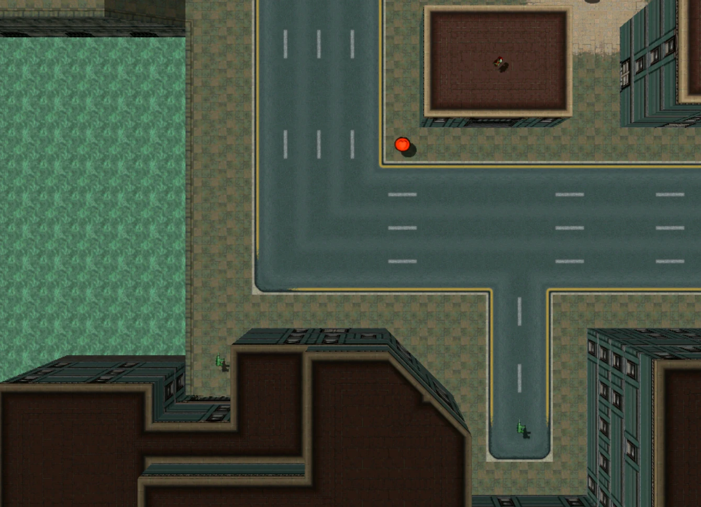
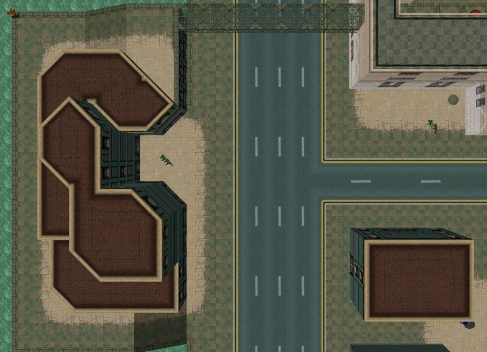
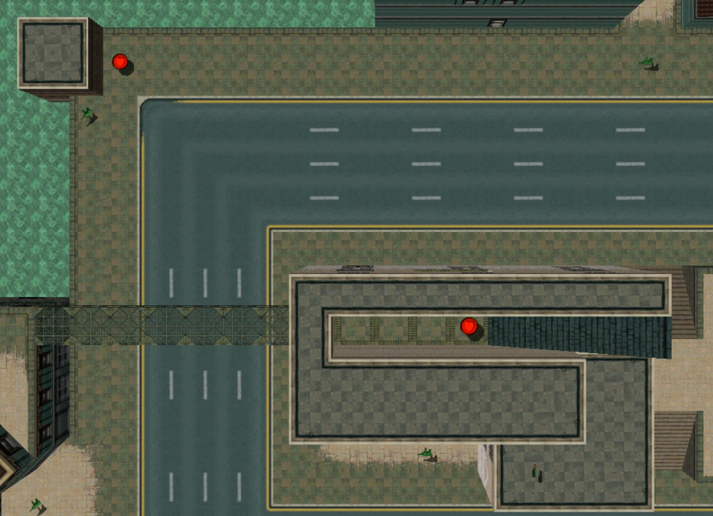
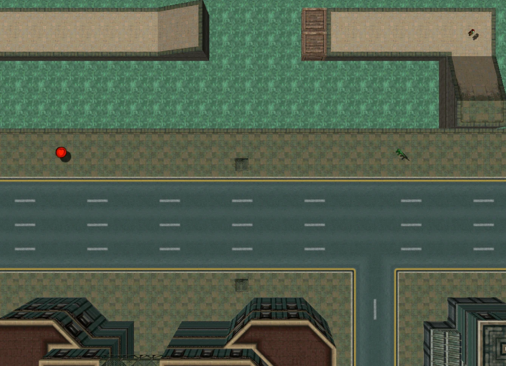
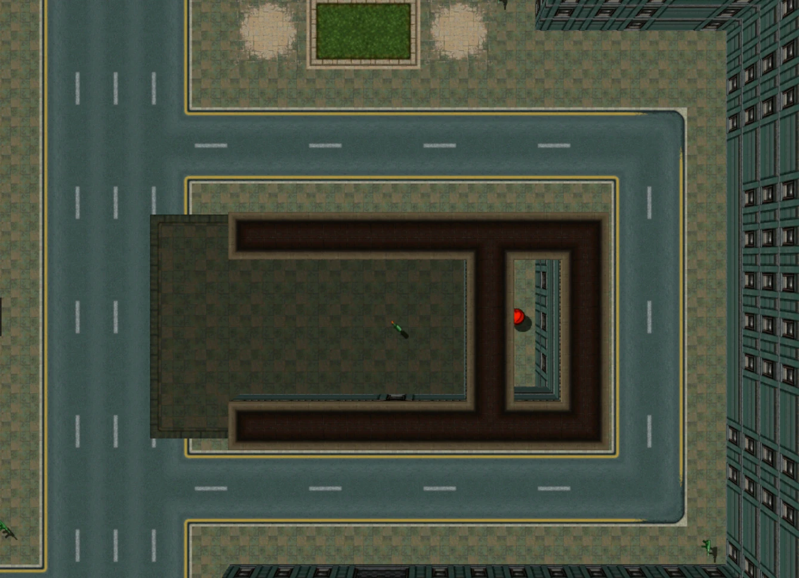
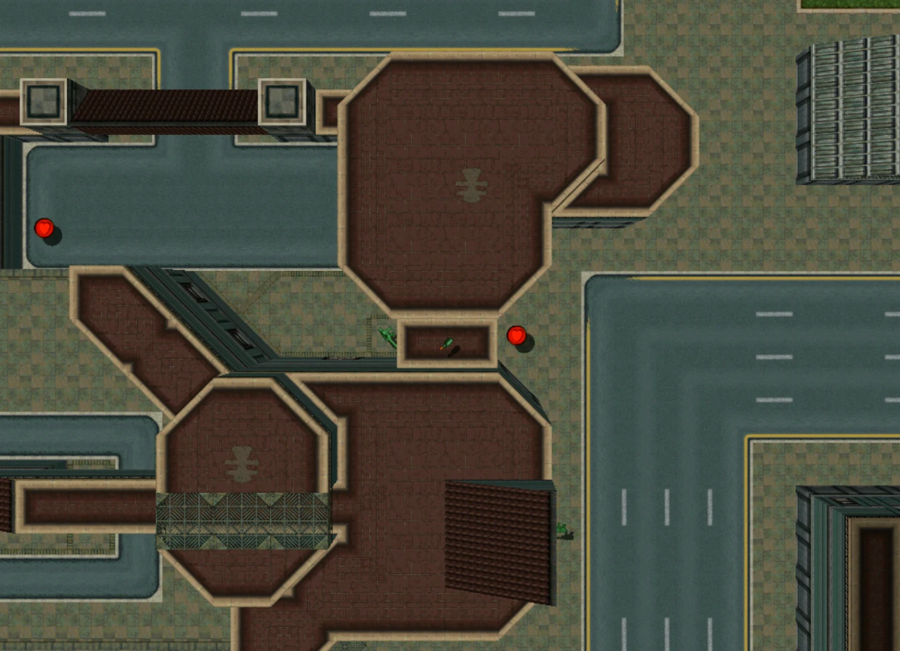
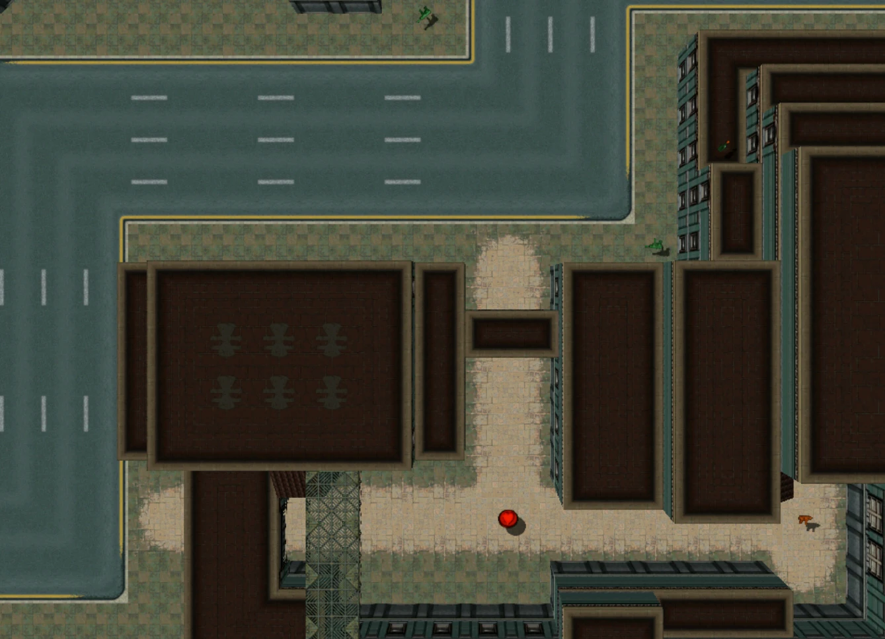

# Enter A Tank

They see me rollin'  
They hatin'  

## Features

- Entering any tank instantly wins you the game (grants you 987654321 points)
- There are no tanks pre-placed on the map (only Police Level 6 makes
  them spawn)
- The match escalates after 8 Minutes, spawning players on Police Level 3, after
  another 6 Minutes it escalates again spawning players on Police Level 5
- Majority of pedestrians are part of a dummy gang, whereby killing them doesn't raise Police
  Level
- Low ammo SMG and Health spawns spread throughout the map, with the occasional
  special weapon to incentivize movement
- Modified version of 'Tiny Yakuza Town', which itself is a modified version of
  'Tiny Town'
- 1-6 Player Support
- Required Game Mode: Points Game

## [Download](https://github.com/Vorschreibung/gta2maps/raw/main/map-enter-a-tank/dist/map-enter-a-tank-v0.1.zip)
### [Sources](https://github.com/Vorschreibung/gta2maps/tree/main/map-enter-a-tank/)

---

